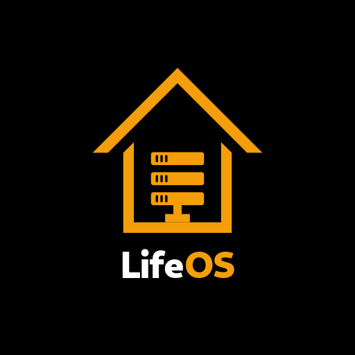

<div align="center">


<a href="https://portfolio.ivanjonasfc.dev"></a>
<a href="https://www.linkedin.com/in/ivanjonasfc/"></a>
<a href="mailto:ivanjonasfc@gmail.com"></a>
<a href="https://portfolio.ivanjonasfc.dev/cv/CV-Ivan-Jonas-ES.pdf"></a>

</div>

## Sobre mí

```yaml
nombre:      Iván Jonás Fernández Correa
rol:         Desarrollador Full-Stack & DevOps
ubicación:   Gijón, Asturias  (remoto / híbrido / presencial en Asturias)
formación:   DAM (desarrollo) + ASIR (sistemas)
enfoque:     full-stack (Java, Python, TypeScript) + IaC (Docker, Linux, CI/CD) + IA (RAG, MCP)
lema:        "Automate everything"
disponible:  para trabajar
diferencia:  escribo el código y administro la infraestructura donde corre
```

## Lo que construyo

| Desarrollo | Infraestructura e IA |
| --- | --- |
| APIs REST con **NestJS**, **Spring Boot** y **FastAPI** | Homelab **24/7**: ~30 servicios en **Docker** sobre NAS Synology |
| Apps **Angular + Ionic** y web **Astro / Next.js / React** | **Caddy** (TLS auto), **WireGuard**, Cloudflare DNS+DDNS |
| Autenticación **JWT/RBAC**, cifrado **AES-GCM** | **GitOps/CI-CD con Forgejo** + automatización con **n8n** |
| Bases de datos **PostgreSQL / MongoDB / Redis** | Observabilidad: **Prometheus, Grafana, Loki, Tempo** |
| **IA propia**: RAG sobre **pgvector/Qdrant** + LLMs vía **MCP** | Contenedores endurecidos, backups con pruebas de restauración |

## Proyecto destacado — LifeOS

<table>
  <tr>
    <td width="170" align="center" valign="top">
      
    </td>
    <td valign="top">
      <b>Suite familiar self-hosted con IA propia ("Lito").</b> Devuelve la soberanía de tus datos: vive en tu propio servidor, sin suscripciones ni terceros.
      <br/><br/>
      &bull; <b>Backend:</b> NestJS + PostgreSQL + TypeORM + BullMQ + Redis<br/>
      &bull; <b>Frontend:</b> Angular 18 + Ionic 8 (app Android)<br/>
      &bull; <b>IA "Lito":</b> RAG sobre pgvector/Qdrant + LLMs vía <b>Model Context Protocol (MCP)</b><br/>
      &bull; <b>Módulos:</b> chat cifrado, calendario, gastos con splits en tiempo real, nube, notas, geolocalización y panel de administración
    </td>
  </tr>
</table>

<details>
<summary><b>Otros proyectos</b></summary>

| Proyecto | Descripción | Enlace |
| --- | --- | --- |
| **OposApp** | TFG (DAM): seguimiento del BOPA + tests con IA local (Flutter + Spring Boot) | [GitHub](https://github.com/IvanjonasFC/OposApp) |
| **Hooklab** | Constructor/firmador/verificador de webhooks, 100% cliente | [hooks.ivanjonasfc.dev](https://hooks.ivanjonasfc.dev) |
| **Acopio de Código** | Vault de comandos de infra y desarrollo | [syntax.ivanjonasfc.dev](https://syntax.ivanjonasfc.dev) |

</details>

## Tech Stack

**Backend y Runtime**  


**Frontend y Móvil**  


**Datos e IA**  


**DevOps e Infraestructura**  


## Estadísticas de GitHub

<div align="center">


</div>

<div align="center">


</div>

## Gráfico de contribuciones

<div align="center">


</div>

## Conecta conmigo

<div align="center">

<a href="https://portfolio.ivanjonasfc.dev"></a>
<a href="https://www.linkedin.com/in/ivanjonasfc/"></a>
<a href="mailto:ivanjonasfc@gmail.com"></a>
<a href="https://github.com/IvanjonasFC"></a>

<br/><br/>


</div>


